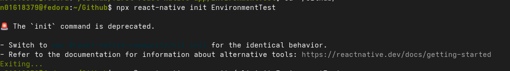
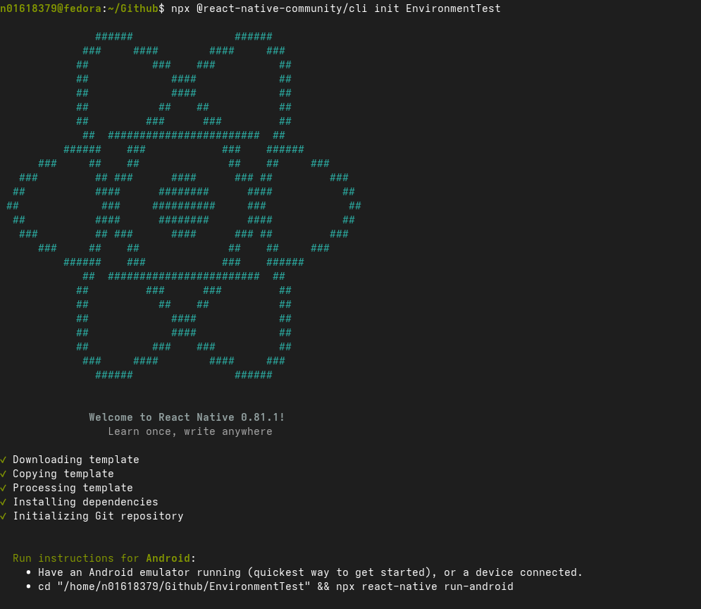
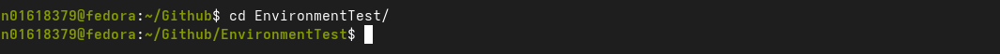
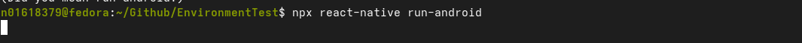
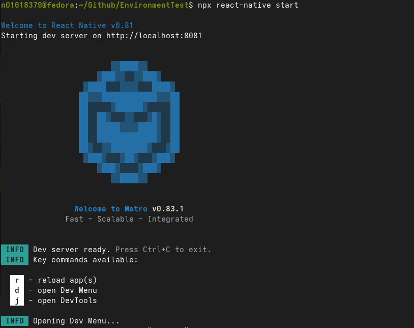
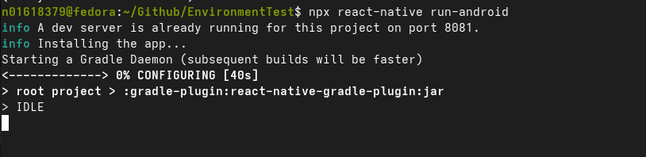
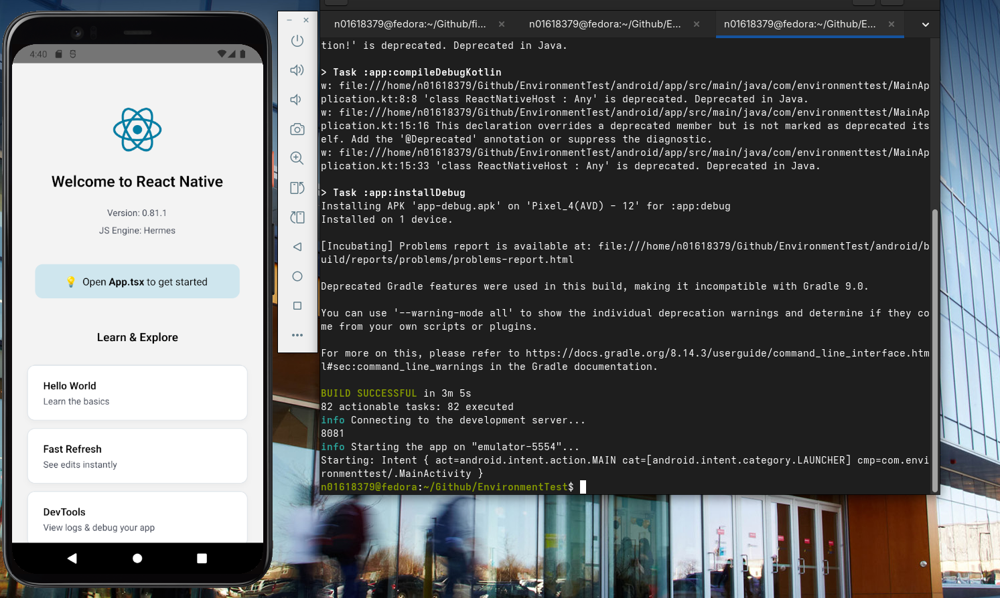
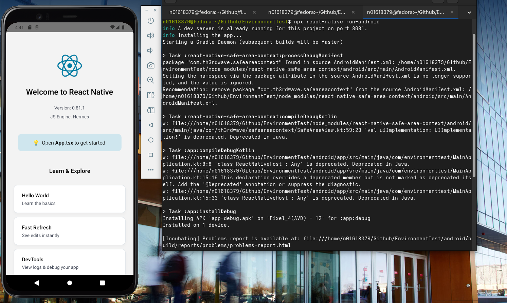
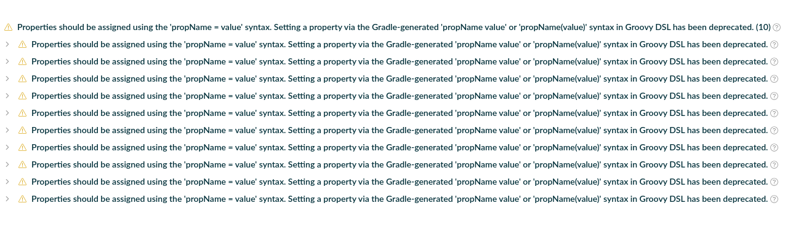

# Exercise 1

## Errors

### Step 1: Create a test project to verify setup
running `npx react-native init EnvironmentTest` did not work.

had to switch to the reccomended command: `npx @react-native-community/cli init`

### Step 2: Run the project

For Andriod: `npx react-native run-android`
For IOS: `npx react-native run-ios` (you need macOS for this)

unfornately running this command alone did not show results

In order for me to successfully run the program I had to run `npx react-native start` on a separate terminal

then afterwards I have to run `npx react-native run-android`

### Step 3: Verify app loads successfully

#### Additional Errors

##### Error 1 

> \> Task :react-native-safe-area-context:processDebugManifest
> package="com.th3rdwave.safeareacontext" found in source AndroidManifest.xml: /home/n01618379/Github/EnvironmentTest/node_modules/react-native-safe-area-context/android/src/main/AndroidManifest.xml.
> Setting the namespace via the package attribute in the source AndroidManifest.xml is no longer supported, and the value is ignored.
> Recommendation: remove package="com.th3rdwave.safeareacontext" from the source AndroidManifest.xml: /home/n01618379/Github/EnvironmentTest/node_modules/react-native-safe-area-context/android/src/main/AndroidManifest.xml.

##### Error 2
> \> Task :app:compileDebugKotlin
> w: file:///home/n01618379/Github/EnvironmentTest/android/app/src/main/java/com/environmenttest/MainApplication.kt:8:8 'class ReactNativeHost : Any' is deprecated. Deprecated in Java.
> w: file:///home/n01618379/Github/EnvironmentTest/android/app/src/main/java/com/environmenttest/MainApplication.kt:15:16 This declaration overrides a deprecated member but is not marked as deprecated itself. Add the '@Deprecated' annotation or suppress the diagnostic.
> w: file:///home/n01618379/Github/EnvironmentTest/android/app/src/main/java/com/environmenttest/MainApplication.kt:15:33 'class ReactNativeHost : Any' is deprecated. Deprecated in Java.

##### Error 3 

> \> Task :app:compileDebugKotlin
> w: file:///home/n01618379/Github/EnvironmentTest/android/app/src/main/java/com/environmenttest/MainApplication.kt:8:8 'class ReactNativeHost : Any' is deprecated. Deprecated in Java.
> w: file:///home/n01618379/Github/EnvironmentTest/android/app/src/main/java/com/environmenttest/MainApplication.kt:15:16 This declaration overrides a deprecated member but is not marked as deprecated itself. Add the '@Deprecated' annotation or suppress the diagnostic.
> w: file:///home/n01618379/Github/EnvironmentTest/android/app/src/main/java/com/environmenttest/MainApplication.kt:15:33 'class ReactNativeHost : Any' is deprecated. Deprecated in Java.

##### Error logs

